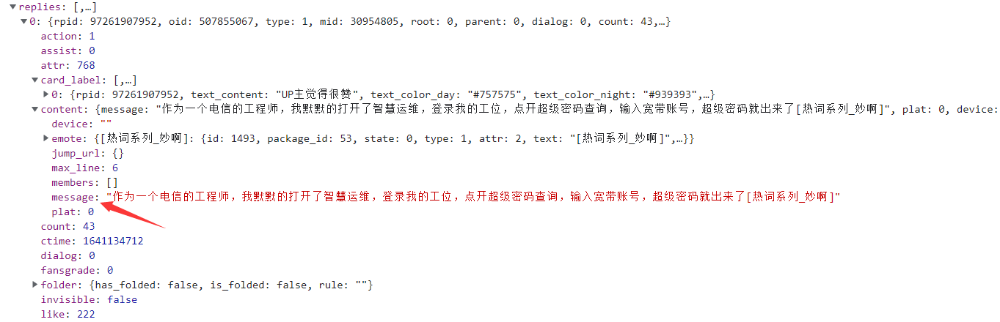

# 弹幕和评论区的信息特征研究(Barrage and comment)

### 研究对象：

本文选择的视频网站弹幕和评论区的信息特征研究实证对象为`BiliBili`平台，它是较早使用弹幕功能的视频在线播放平台之一，具有注册用户即时发送弹幕、弹幕点赞、弹幕字体颜色，评论互动等功能。

### 研究的背景：

随着`BiliBili`弹幕功能的推出，视频的交互性和及时沟通性显著得以提高，弹幕的受众和影响力不断扩大，导致弹幕和评论信息呈爆炸式增长。这同时也带来了大量无效和引战的弹幕和评论，弹幕和评论的信息有用性检测逐渐重要，这也能凸显信息的有用性检测的重要学术和商业价值。

本课程实验主要进行三个方面探索：一是信息特征，如弹幕表达形式通常作为主要衡量指标。二是文本特征，包括文本长度和单词数目等。三是用户自身特征与信息有用性关系密切。本文将检测弹幕信息有用性作为目标，从弹幕信息效用、弹幕表达形式和弹幕用户特征三个角度得到各等级信息有用性的检测结果，概括相关特征作为具有决定性的影响变量。

### **意义：**

对弹幕文本内容进行挖掘与审核，能正确引导视频观看用户合理讨论，发送文明弹幕，有助于营造和谐稳定的视频观看环境。


### 文件说明：

- check.text: 观察请求评论区数据的`url`请求包，得到请求规律
- 


### Python环境

- Python3.9

- pandas
- numpy
- scrapy
- PyCharm

 

## 数据获取

### 数据获取方式

通过爬虫爬取获取数据


**相关理论：**浏览器进入哔哩哔哩官网，打开一个视频。进入开发者工具，清除数据包后，向下拖动评论区可以发现哔哩哔哩的评论区采用的是懒加载模式。浏览器发送`GET`请求，服务器收到请求后返回数据一次返回固定的长度。当页面显示的长度大于浏览器返回包的长度时进行懒加载一次，加载一次浏览器发送一次`GET`请求，服务器返回一次数据，返回了数据里 `res.data`包括了评论区里面的真实回答。找到这些回答的包以后，删除相应包的参数，可以发现请求的浏览器发出的请求的`url`，将`url`复制到筛选框内，筛选对应的包，可以找到所有请求评论评论的所有`url`。通过抓包分析到三个`url`即可得到请求评论区数据的请求包规律。 


**确定到的请求网址**

`start_url = https://api.bilibili.com/x/v2/reply/main?jsonp=jsonp&next={}&type=1&oid=507855067&mode=3&plat=1&_=1650361573280`


## 数据探索

### 数据基本信息

（简要介绍数据的基本信息，如数据文件类型，包含的内容等等）

`replies`为有逻辑编号的列表，


需要的数据在`replies[0].content.message`



一级评论：https://api.bilibili.com/x/v2/reply/main?jsonp=jsonp&next=0&type=1&oid=208143004&mode=3&plat=1

        next：翻页
        oid：视频编号（aid）
        mode：1、2表示按热度、时间排序;  0、3表示按热度排序，并显示评论和用户信息
二级评论：https://api.bilibili.com/x/v2/reply/reply?jsonp=jsonp&pn=1&type=1&oid=208143004&ps=10&root=5453611704

        pn：翻页
        oid：视频oid
        root：楼主的回复的rpid
        ps: 单页显示数量（最大为20）


### 数据读取

读取数据使用了`requests.get`函数。通过`requests.get(url, headers)`构造一个向服务器请求资源的url对象。这个对象是手动生成的。这时候的r返回的是一个包含服务器资源的Response对象。包含从服务器返回的所有的相关资源。

**获取数据代码：**

```python
def main():
        print('爬取懒加载节点{}的数据!'.format(i))
        start_url = f'https://api.bilibili.com/x/v2/reply/main?jsonp=jsonp&next=1&type=1&oid=507855067&mode=3&plat=1&_=1650361573280'
        headers = {
            'user-agent': 'Mozilla/5.0 (Windows NT 10.0; Win64; x64) AppleWebKit/537.36 (KHTML, like Gecko) Chrome/100.0.4896.88 Safari/537.36',
            'referer': 'https://www.bilibili.com/video/BV1Zu411m72m?spm_id_from=333.999.0.0'
        }
        response = requests.get(start_url, headers = headers).json()
        ic(response)
```

由于本机的`cmd`的下载会调入`Acaconda`模块，而`vscode`的控制台会调用此处`C:\Python310\python.exe`，需要手动加`Acaconda`路径，或者将`Acaconda`的环境变量暴露出去，就可以解决该问题

```cmd
&D:\Data\Acaconda\python.exe D:\Study\course\Python\NO8\get_data.py
```


## 数据清洗与预处理

**评论信息数据清洗**

提取`replies.message`内容，该内容即为评论信息

 ```python
replies = jsonpath(response,'$..replies')
message_list = jsonpath(replies,'$..message')
name = message['member']['uname']       # 昵称
sex = message['member']['sex']          # 性别
sign = message['member']['sign']          # 签名
rcount = message['rcount']                # 回复数
like = message['like']                    # 点赞数
content = message['content']['message']      # 评论内容
 ```


**弹幕信息数据清洗**

提取`response.text`内容，该内容即为弹幕信息

在线正则表达式测试 https://tool.oschina.net/regex#

测得正则式`[\u4e00-\u9fa5]+`，但是空格会造成输出换行，使用`.*?([\u4e00-\u9fa5]+).*`

```python
res = re.findall('.*?([\u4e00-\u9fa5]+).*',response.text)
```


## 数据分析及可视化

```python
def parse_img(big_list):
    print('----------词云生成中------------')
    data = ''.join(big_list)
    stylecloud.gen_stylecloud(data,font_path="C:/Windows/Fonts/simfang.ttf")
    img = Image.open("D:/Study/course/Python/NO8/stylecloud.png")
    img.show()
    print('----------词云已生成------------')
```

### 弹幕密度

从弹幕密度研究，随着用户参与度提高，弹幕数量日渐庞大且不断增长，密集的文字铺满屏幕，可能会对用户观看体验造成一定的影响。


### 弹幕文本

我认为弹幕语言有其独特语境，在语音、文字、词汇、句法和语义方面不同于其他网络语言。


从弹幕文本研究，张俊杰分析收集视频弹幕数据发现，80%以上的弹幕在30字符以下。从传播学角度研究，网络媒体有丰富的符号化表达方式，弹幕的语言模式成为研究关注的重点。例如，沈文静将弹幕分为文字类和非文字类符号，付阳春按照弹幕语言成因分为操作类、情感类、来源类和其他4类


可见弹幕信息时效性较高且表现稳定，主题相似度偏低，大量用户倾向于即时发表感受或想法，不会考虑根据热点主题进行针对性评论。弹幕表现形式相关指标(文本字数、文本颜色、句子完整程度、句子互动性)，文本字数均值为9.89，大部分弹幕文本长度为10个字左右;文本颜色特征均值为0.24，彩色弹幕数目较少，白色弹幕为用户使用弹幕颜色主流;另外，句子完整程度居中，句子互动性偏低。弹幕用户特征(用户会员等级、用户发送活跃程度)，大量用户会员等级普遍较低，均值为1.02，且差异性不明显;而用户发送活跃程度平均值为37.93，标准差为76.55，离散程度较高,不同用户发送活跃程度差异性较大。

弹幕信息中传递的用户观点和想法越来越多地被视频创作者和平台关注，且在产品功能上十分重视弹幕的筛选和审核机制然而，信息有用性在不同程度上取决于个人的主观认知，


### 信息时效性

#### 弹幕时效

在时间维度上，通常网页评论有用性与评论快慢相关。而在视频环境中，弹幕信息与视频当中对应内容具有一定相关性，弹幕及时性体现在能否快速与视频中不同的片段进行呼应。弹幕频率随时间波动，通过王蕊等的数据研究表明，弹幕在戏剧冲突点最为密集。

#### 信息时效


### 个体差异性

个体差异性使弹幕用户在信息表达方面有所偏差，信息发布者特征对于信息有用性同样重要。例如，在大众点评网的实证研究中，点评者经验对于点评有用性呈正相关，在开放式创新社区中，用户主动贡献程度正向影响信息有用性。

如高级会员、UP主能够有更多的效果或文字。另外，会员等级反映了对视频平台的时间或金钱投人，会员等级高的用户具有更强的依赖性。不同的会员等级的用户，其弹幕信息使用经验和倾向可能有所差异，对弹幕信息有用性有一定影响。

用户发送活跃程度。弹幕信息是用户自我呈现的一种方式,用户参与度受用户性格的影响,


### 恶意水军

 一个人发多少弹幕 评论


## 心得体会

本实验信息效用和弹幕用户特征。对于弹幕表现形式而言，文本字数占据重要贡献度，其他带有感情的特征项无法做到有用性检测。由此可以推断,弹幕表现形式相对而言发挥的作用很小,网络环境中用户更注重信息内容，对于信息表达的规范性和完整度不太关注。因此,在进行弹幕信息有用性识别时,应重视用户通过弹幕传达出的信息信号和情感信号。弹幕具有丰富的表现形式，改变了用户的视觉体验，如红色弹幕比较具有警示意义。

时间允许情况下应使用不同的机器学习算法，对弹幕文本特征与含义进行更深层次挖掘，进行深度分析。无法检测到不文明或敏感弹幕，避免弹幕环境恶化。对弹幕文本内容进行挖掘与审核，能正确引导视频观看用户合理讨论，发送文明弹幕，有助于营造和谐稳定的视频观看环境。

本文尚有许多值得改进的地方，例如在考虑信息有用性影响因素时，未能涵盖文本语言上的特征，在全面性上有进一步提高的空间。弹幕信息有用性不同等级样本数量的不均衡，算法分类精度效果有限。


学生签字：手写

提交日期：2022年04月20日